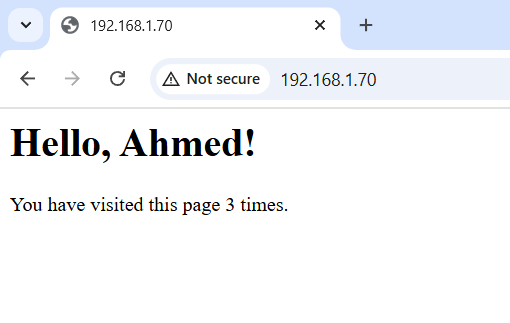

# Ansible Installation on Ubuntu Master

## Introduction
This guide provides step-by-step instructions to install and set up Ansible on an Ubuntu master node.

## Prerequisites
- Ubuntu 22.04 
- Sudo privileges
- Internet connection
- Python 3 and pip (installed by default on Ubuntu, but verify using `python3 --version`)

If Python is missing, install it using:
```bash
sudo apt install python3 python3-pip -y
```

## Installation Steps

### 1. Update System Packages
```bash
sudo apt update && sudo apt upgrade -y
```

### 2. Install Ansible
```bash
sudo apt install ansible -y
```

### 3. Verify Installation
```bash
ansible --version
```

You should see output similar to:
```
ansible [core 2.14.0]
  config file = /etc/ansible/ansible.cfg
  ...
```

## Configuring Ansible

### 4. Setup Inventory File
A custom inventory file exists in the same directory as this README. To define managed nodes, edit the inventory file:
```bash
nano inventory
```
Add the following content:
```
[servers]
server ansible_host=worker-ip ansible_user=user ansible_ssh_private_key_file=path-to-private-key
```

### 5. Test Connectivity
Ensure Ansible can communicate with managed nodes:
```bash
ansible all -m ping -i inventory
```
Expected output:
```
server1 | SUCCESS => {
    "changed": false,
    "ping": "pong"
}
```

## Running an Ansible Playbook

### 6. Create a Simple Playbook
Create a new YAML file:
```bash
nano playbook.yaml
```
Add the following content:
```yaml
- name: Install LEMP stack on Ubuntu 22.04
  hosts: all
  become: true
  tasks:
    - name: Update all packages to latest
      apt:
        name: "*"
        state: latest
        ...
```

### 7. Execute the Playbook
```bash
ansible-playbook playbook.yaml -i inventory
```

## Screenshots
### Target Machine Connectivity


### Ansible Playbook Execution


### Application 


### DataBase


## Conclusion
For more information, visit [Ansible Documentation](https://docs.ansible.com/).

