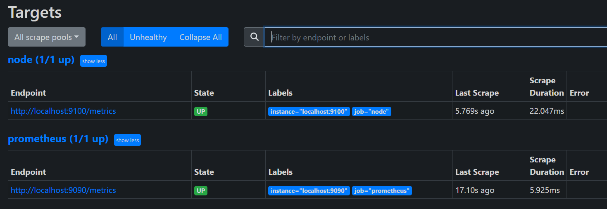
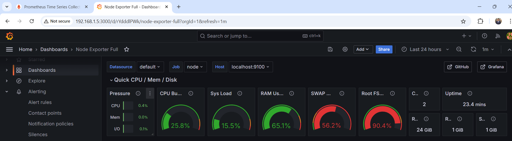

# Prometheus, Node Exporter and Grafana Installation Guide

## Prerequisites
Ensure you have `sudo` privileges on your Linux machine.

## Step 1: Create Prometheus User and Group
```bash
sudo groupadd --system prometheus
sudo useradd -s /sbin/nologin --system -g prometheus prometheus
```

## Step 2: Create Required Directories
```bash
sudo mkdir /etc/prometheus
sudo mkdir /var/lib/prometheus
```

## Step 3: Download and Install Prometheus
```bash
wget https://github.com/prometheus/prometheus/releases/download/v2.43.0/prometheus-2.43.0.linux-amd64.tar.gz
tar vxf prometheus*.tar.gz && cd prometheus*/
sudo mv prometheus /usr/local/bin
sudo mv promtool /usr/local/bin
sudo chown prometheus:prometheus /usr/local/bin/prometheus
sudo chown prometheus:prometheus /usr/local/bin/promtool
sudo mv consoles /etc/prometheus
sudo mv console_libraries /etc/prometheus
sudo mv prometheus.yml /etc/prometheus
sudo chown prometheus:prometheus /etc/prometheus
sudo chown -R prometheus:prometheus /etc/prometheus/consoles
sudo chown -R prometheus:prometheus /etc/prometheus/console_libraries
sudo chown -R prometheus:prometheus /var/lib/prometheus
```

## Step 4: Configure Prometheus
Edit the Prometheus configuration file:
```bash
sudo nano /etc/prometheus/prometheus.yml
```
Add the following to the bottom of the file:
```yaml
- job_name: "node"  
  static_configs:
    - targets: ["localhost:9100"]
```

## Step 5: Create Prometheus Systemd Service File
```bash
sudo nano /etc/systemd/system/prometheus.service
```
Add the following content:
```ini
[Unit]
Description=Prometheus
Wants=network-online.target
After=network-online.target

[Service]
User=prometheus
Group=prometheus
Type=simple
ExecStart=/usr/local/bin/prometheus \
    --config.file /etc/prometheus/prometheus.yml \
    --storage.tsdb.path /var/lib/prometheus/ \
    --web.console.templates=/etc/prometheus/consoles \
    --web.console.libraries=/etc/prometheus/console_libraries

[Install]
WantedBy=multi-user.target
```

## Step 6: Start and Enable Prometheus
```bash
sudo systemctl daemon-reload
sudo systemctl enable --now prometheus
```

## Step 7: Configure Firewall
If you have a firewall active, allow Prometheus traffic:
```bash
sudo ufw allow 9090/tcp
```

## Step 8: Install Node Exporter
```bash
wget https://github.com/prometheus/node_exporter/releases/download/v1.8.2/node_exporter-1.8.2.linux-amd64.tar.gz
tar -xvf node_exporter-1.8.2.linux-amd64.tar.gz && cd node_exporter*/
sudo cp node_exporter /usr/local/bin
sudo useradd --no-create-home --shell /bin/false node_exporter
sudo chown node_exporter:node_exporter /usr/local/bin/node_exporter
```

## Step 9: Create Node Exporter Systemd Service File
```bash
sudo vi /etc/systemd/system/node_exporter.service
```
Add the following content:
```ini
[Unit]
Description=Node Exporter
Wants=network-online.target
After=network-online.target

[Service]
User=node_exporter
Group=node_exporter
Type=simple
ExecStart=/usr/local/bin/node_exporter

[Install]
WantedBy=multi-user.target
```

## Step 10: Start and Enable Node Exporter
```bash
sudo systemctl daemon-reload
sudo systemctl enable --now node_exporter
```


## Step 11: Access Prometheus
Prometheus can be accessed through the web at:
```
http://<ip-address>:9090
```



## Step 12: Install Grafana
```bash
sudo mkdir -p /etc/apt/keyrings/
wget -q -O - https://apt.grafana.com/gpg.key | gpg --dearmor | sudo tee /etc/apt/keyrings/grafana.gpg > /dev/null
echo "deb [signed-by=/etc/apt/keyrings/grafana.gpg] https://apt.grafana.com stable main" | sudo tee -a /etc/apt/sources.list.d/grafana.list
echo "deb [signed-by=/etc/apt/keyrings/grafana.gpg] https://apt.grafana.com beta main" | sudo tee -a /etc/apt/sources.list.d/grafana.list
sudo apt-get update
sudo apt-get install grafana
sudo systemctl daemon-reload
sudo systemctl enable --now grafana-server.service
```

## Step 13: Access Grafana
Grafana can be accessed through the web at:
```
http://<ip-address>:3000
```
Use `admin` for both the username and password, then click OK.

## Step 14: Import or Customize Dashboards
Grafana allows to import dashboards or create custom dashboards 



## End 