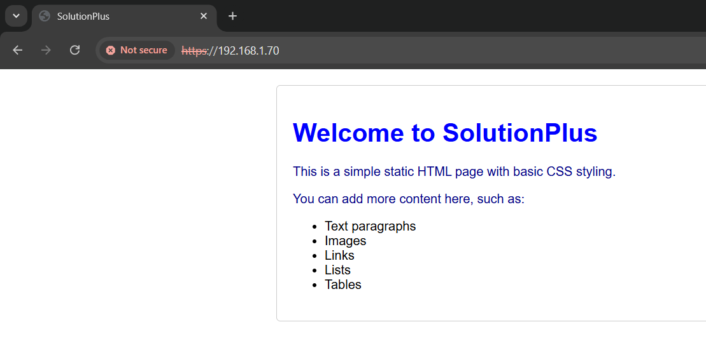

# LEMP Stack Installation and Configuration on Ubuntu 22.04

This document provides steps to set up a LEMP (Linux, Nginx, MySQL, PHP) stack on Ubuntu 22.04 (Centralized Server Architecture), including the configuration of a self-signed SSL certificate using OpenSSL.

## Table of Contents

- [Ansible Configuration](./Ansible)
- [Bash Scripting](./Bash-script/)
- [Monitoring](./Monitoring/)
- [Prerequisites](#prerequisites)
- [Installation Steps](#installation-steps)
  - [Step 1: Update the System](#step-1-update-the-system)
  - [Step 2: Install Nginx](#step-2-install-nginx)
  - [Step 3: Install MySQL](#step-3-install-mysql)
  - [Step 4: Install PHP and PHP-FPM](#step-4-install-php-and-php-fpm)
  - [Step 5: Configure Nginx to Use PHP](#step-5-configure-nginx-to-use-php)
  - [Step 6: Secure Nginx with a Self-Signed SSL Certificate](#step-6-secure-nginx-with-a-self-signed-ssl-certificate)
    - [Generate a Self-Signed SSL Certificate](#generate-a-self-signed-ssl-certificate)
    - [Configure SSL in Nginx](#configure-ssl-in-nginx)
  - [Step 7: Test the Setup](#step-7-test-the-setup)
- [Troubleshooting](#troubleshooting)
- [Conclusion](#conclusion)

## Prerequisites

- A server running Ubuntu 22.04
- Sudo privileges

## Installation Steps

### Step 1: Update the System
```bash
 sudo -i
 apt update && apt upgrade -y
```

### Step 2: Install Nginx
```bash
 apt install nginx -y
```

### Step 3: Install MySQL
```bash
 apt install mysql-server -y
 mysql_secure_installation
```

### Step 4: Install PHP and PHP-FPM
```bash
 apt install php php-fpm php-mysql -y
```

### Step 5: Configure Nginx to Use PHP
Edit the Nginx configuration file:
```bash
 nano /etc/nginx/sites-available/default
```

Ensure the configuration includes the following PHP handling block:
```nginx
server {
    listen 80;
    server_name your_domain.com;

    root /var/www/html;
    index index.php index.html index.htm;

    location / {
        try_files $uri $uri/ =404;
    }

    location ~ \.php$ {
        include snippets/fastcgi-php.conf;
        fastcgi_pass unix:/var/run/php/php8.1-fpm.sock;
        fastcgi_param SCRIPT_FILENAME $document_root$fastcgi_script_name;
        include fastcgi_params;
    }

    location ~ /\.ht {
        deny all;
    }
}
```

Test the configuration and restart Nginx:
```bash
 nginx -t
 systemctl restart nginx
```

### Step 6: Secure Nginx with a Self-Signed SSL Certificate

#### Generate a Self-Signed SSL Certificate
```bash
 openssl req -x509 -nodes -days 365 -newkey rsa:2048 
 -keyout tls.key -out tls.crt -subj "/CN=test.com/O=test.com"
```


#### Configure SSL in Nginx 

Note: This is a self signed cert not from Certificate Authority, We can use let's encrypt CA in real-world apps.

Edit the Nginx configuration file to include SSL settings:
```bash
 nano /etc/nginx/sites-available/default
```

Add the following lines:
```nginx
server {
     listen 443 ssl default_server;
     listen [::]:443 ssl default_server;

    ssl on;
    ssl_certificate /etc/ssl/tls.crt;
    ssl_certificate_key /etc/ssl/tls.key;

    server_name localhost;

    root /var/www/html;
    index index.php index.html index.htm;

    location / {
        try_files $uri $uri/ =404;
    }

    location ~ \.php$ {
        include snippets/fastcgi-php.conf;
        fastcgi_pass unix:/var/run/php/php8.1-fpm.sock;
        fastcgi_param SCRIPT_FILENAME $document_root$fastcgi_script_name;
        include fastcgi_params;
    }

    location ~ /\.ht {
        deny all;
    }
}
```

Test the configuration and reload Nginx:
```bash
 nginx -t
 systemctl restart nginx
```

### Step 7: Test the Setup

1. Place a test html and PHP file in the web root directory:
   ```bash
   echo "<?php phpinfo(); ?>" | tee /var/www/html/info.php
   cp index.html /var/www/html/
   ```

2. Access the server's IP address or domain name in the browser:
   ```
   http://ip-addr/info.php
   https://ip-addr/info.php
   ```



## Troubleshooting

- Ensure Nginx and PHP-FPM services are running:
  ```bash
  systemctl status nginx
  systemctl status php8.1-fpm
  ```

- Check Nginx and PHP-FPM logs for errors:
  ```bash
  tail /var/log/nginx/error.log
  tail /var/log/php8.1-fpm.log
  ```

## Conclusion

Successfully installed and configured a LEMP stack on Ubuntu 22.04 with a self-signed SSL certificate for secure HTTPS connections.

